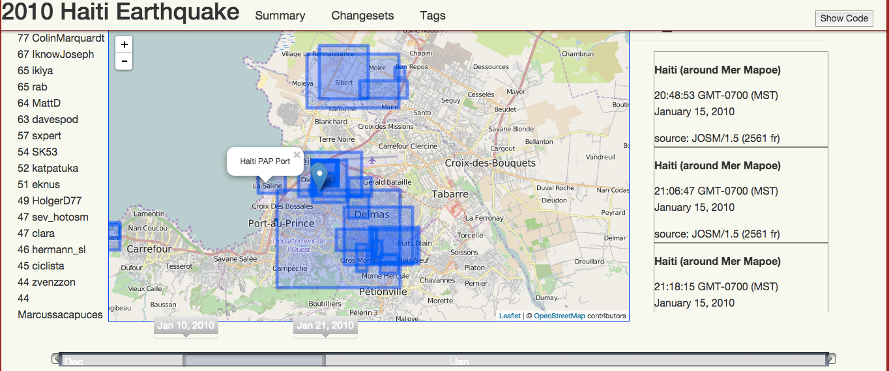
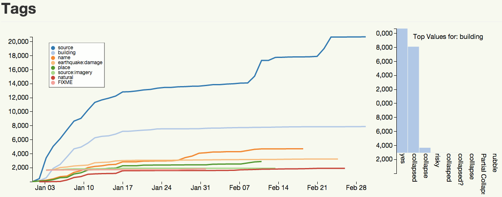

A Software Framework for analyzing OpenStreetMap Contributions
==============================================================
Who mapped where, when, and with whom?

#Setup
The ```setup``` directory contains detailed information on installation for Linux and Mac OS X.  The dependencies are many and somewhat unruly, but we promise it's worth it.

Once dependencies are all installed, running ```bundle install``` from the root of this repository should handle the rest.  _Note,  if you bundle install, you most likely need to add ```bundle exec``` before all of the commands_.


#Analysis Window
An analysis window is a YAML document which defines file locations, database names, and the questions that you'd like to ask of the framework. A basic analysis window looks like this:

	title: 'Chicago 2015'
	pbf_file: '/data/osm_files/splitter_exports/north-america/illinois.osm.pbf'
	database: chicago-2008-10
	start_date: '2008-01-01'
	end_date:   '2010-12-31'
	bbox: '-87.940101,41.643919,-87.523984,42.023022'
	write_directory: '/data/www/chicago'
	Node Questions:
	 - number_of_nodes_edited_by_new_mappers
	 - number_of_nodes_edited_by_experienced_mappers
	Changeset Questions:
	 - changesets_x_day
	User Questions:
	 - total_user_count
	Bbox Questions:
	 - bbox_geojson_geometry


#Command Line Framework Use
There are a series of ```rake tasks``` which run all of the software standalone if you want a command line usage.  Otherwise, see section below on API usage.

###1. Importing Data
All of the cutting and importing is bundled into one rake task:

	rake new ~/my_osm_questions/my_analysis_window.yml

The individual processes that ```rake new``` runs can be run separately as:

	rake cut                    # Write appropriate configuration file and cut ...
	rake import:pbf             # Import PBF File (Nodes, Ways, Relations)
	rake import:changesets      # Import Changesets
	rake import:users           # Import Users
	rake import:notes           # Import Notes

###2. Run Questions
Once the data is imported to Mongo, you can begin to run the questions.

	rake questions:all ~/my_osm_questions/my_analysis_window.yml

This task runs all of these questions tasks, which can also be called individually:

	rake questions:bbox         # Run BBox Questions
	rake questions:changesets   # Run Changeset Questions
	rake questions:multi_users  # Run Multi-User Questions
	rake questions:nodes        # Run Node Questions
	rake questions:notes        # Run Notes Questions
	rake questions:users        # Run User Questions
	rake questions:ways         # Run Way Questions


###3. Analyze Data
All of the questions were written out as **JSON** to the ```write_directory``` in the configuration file.

	$ls /data/www/chicago/json
		number_of_nodes_edited_by_experienced_mappers.json
		number_of_nodes_edited_by_new_mappers.json
		changesets_x_day.json
		bbox_geojson_geometry.json
		total_user_count.json

	$cat data/www/chicago/json/total_user_count.json
		{"Total User Count":238}

###4. Use [OSMDOWN](http://github.com/project-epic/osmdown) to display results
An EPIC-OSM Oriented markdown language and compiler for generating static, interactive HTML docs with d3 and Leaflet (&copy; [OpenStreetMap](http://openstreetmap.org) Contributors):





#API Usage
After including the ruby library, you can call questions directly:

	o = OSMHistory.new(analysis_window: 'sample-awconfig.yml')
	aw = o.analysis_window	
	
	aw.bounding_box.geojson_geometry.to_json
	# => {"type":"Polygon","coordinates" [[[-105.3424072,39.946595], ...
	
	aw.new_contributors.count
	# => 85
	
	q  = QuestionAsker.new(analysis_window: aw)
	q.run('number_of_experienced_users')
	# => Running Function: number_of_experienced_users...Up to QM...Success
	
The final command created the JSON file: ```number_of_experienced_users.json``` in the ```write_directory```/```json``` as specified in the ```sample-awconfig.yml```.
	


#License
Distributed Under the MIT License<br>
&copy; 2015 The Regents of the University of Colorado
